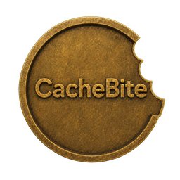
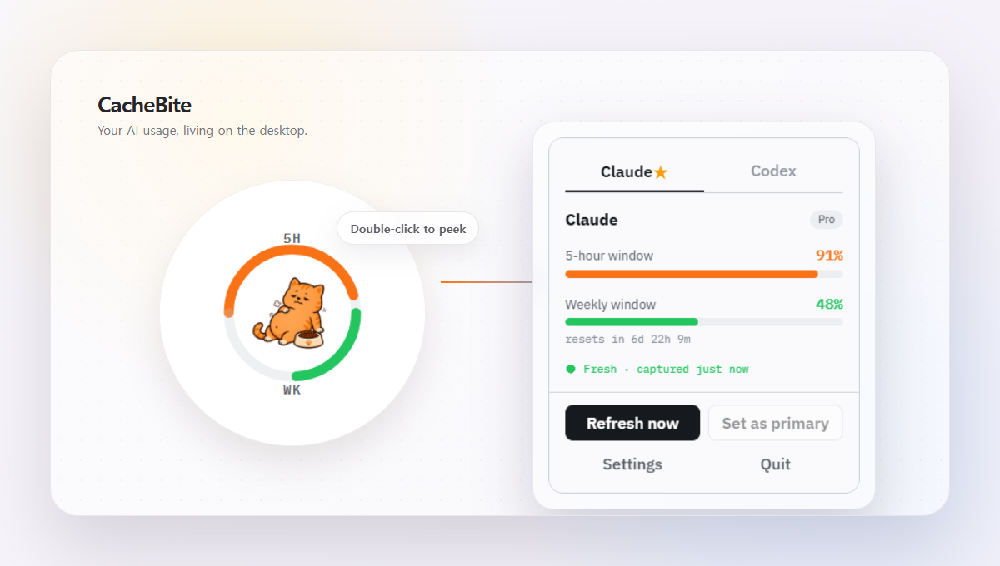

  

<h1 align="center">CacheBite</h1>

  A small desktop pet for Claude and Codex usage, with local-only credentials and a beta release cadence.

  <a href="README.md">한국어</a> · English

  
  
  
  
  
  
  

  <a href="#quick-start">Quick Start</a> ·
  <a href="#using-cachebite">Using CacheBite</a> ·
  <a href="#how-it-works">How It Works</a> ·
  <a href="#features">Features</a> ·
  <a href="#privacy">Privacy</a> ·
  <a href="#beta-status-and-limits">Beta Status</a> ·
  <a href="#release-engineering">Release Engineering</a>

  

---

## Quick Start

> **Unsigned beta warning:** CacheBite builds are not code-signed yet. Windows will show SmartScreen warnings, macOS Gatekeeper will block the unsigned DMG until you clear quarantine, and Linux uses an AppImage that needs WebKitGTK 4.1 on the host.

Download the latest beta from [GitHub Releases](https://github.com/chanhoan/CacheBite/releases).

| Platform | Artifact                | Note                                                         |
| -------- | ----------------------- | ------------------------------------------------------------ |
| Windows  | MSI and NSIS installers | Install over the previous beta when you upgrade.             |
| macOS    | Unsigned validation DMG | This is validation-only for now, not notarized distribution. |
| Linux    | AppImage                | Requires WebKitGTK 4.1 and related desktop prerequisites.    |

Verify downloads against `SHA256SUMS.txt` before installing. Platform-specific install steps and beta reporting rules live in [docs/beta-testing.md](docs/beta-testing.md).

### Before first launch

- Claude needs Claude Code signed in on this machine.
- Codex needs the `codex` CLI on your `PATH` and signed in.
- One provider alone is fine. If only one provider is signed in, CacheBite will still show the other as unavailable instead of pretending it has data.

---

## Using CacheBite

1. Install and launch CacheBite.
2. A small pet appears on your desktop. Drag it anywhere. The position is saved per display.
3. Double-click the pet, or press Enter while it has focus, to open the usage panel.
4. The panel shows Claude and Codex as tabs, not side by side. Each tab shows a session arc and a weekly arc. For the currently supported providers, the session arc is surfaced as a 5-hour window.
5. Switch tabs to inspect the other provider.
6. Click `Refresh now` to fetch fresh usage, or `Set as primary` to choose the provider whose usage drives the pet ring and status.
7. Open `Settings` to change appearance, primary provider, pet, bubbles, notifications, secondary provider notifications, and start at login.

The pet you pick is independent from the primary provider. Changing one does not change the other.

The ring's two arcs represent the session window and the weekly window. The pet's mood follows the primary provider's usage, so the desktop state tracks the provider you care about most.

UI states shown in the app:

- `Fresh` means the snapshot is current.
- `Stale` means the data is still shown, but it is past the fresh window.
- If a provider is signed out or unavailable, CacheBite shows that state instead of pretending it has usage data.
- Fullscreen detection is unavailable on the current build, so CacheBite does not currently hide the pet during presentations. It surfaces that status instead of pretending otherwise.

---

## How It Works

1. CacheBite collects provider usage locally on your machine.
2. Rust normalizes the provider-specific responses into a shared usage model.
3. The Svelte renderer displays the pet, ring, panel, and settings from that normalized state.
4. Speech bubbles and notifications are driven from local usage transitions, not from a remote CacheBite service.

---

## Features

| Area        | What CacheBite does                                                                                 |
| ----------- | --------------------------------------------------------------------------------------------------- |
| Desktop pet | Keeps a movable pet on screen and remembers its position per display.                               |
| Usage view  | Shows Claude and Codex in tabs, with session and weekly windows.                                    |
| Ring state  | Uses the primary provider to drive the pet's mood and ring state.                                   |
| Settings    | Lets you switch appearance, provider focus, pet choice, bubbles, notifications, and start at login. |

---

## Privacy

> CacheBite keeps provider credentials local. Nothing is sent through a CacheBite server, and the renderer only receives normalized state.

- There is no CacheBite cloud service.
- Credential access, collection, refresh scheduling, and persistence live in the Rust core.
- The Svelte renderer only receives normalized state.
- CacheBite does not read browser cookies.
- Provider raw responses, account identifiers, and credential paths do not belong in logs or screenshots.
- Credential files are handled read-only.

---

## Beta Status and Limits

- The beta is still unsigned.
- Release publishing still needs a manual step.
- There is no auto-updater yet.
- Fullscreen detection is unavailable on the current build, so the pet does not currently hide during presentations.
- When only one provider is signed in, the other provider remains unavailable.

---

## Release Engineering

- Tag pushes create a draft GitHub release with the platform installers and checksums attached.
- Publishing the release stays a manual step.
- A signed and notarized macOS build is only produced through the protected `production-macos-signing` workflow input.

---

## License

No project license has been selected yet. Until one is added, all rights are reserved.
